# 👕 Daffr — MERN E-Commerce for Local Fashion

**Daffr** is a full-stack e-commerce platform that brings the charm of Lucknow’s clothing markets online.

[](./LICENSE)
[](https://github.com/shahmohsiin/Daffr-Clothing)
[](https://github.com/shahmohsiin/Daffr-Clothing)

---

## 🌟 Project Overview

**Daffr** is a modern full-stack **MERN** application built to digitize the charm of **Lucknow’s local clothing markets**. It serves as a sleek, responsive e-commerce platform where users can explore, purchase, and get apparel delivered right to their doorstep — all while supporting local artisans and vendors.

---

<p align="center">
  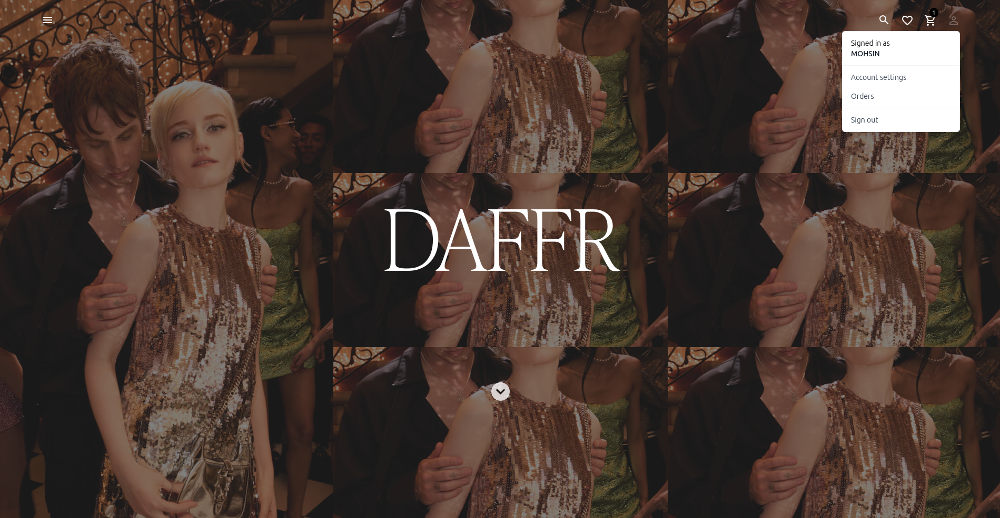
</p>

<p align="center">
  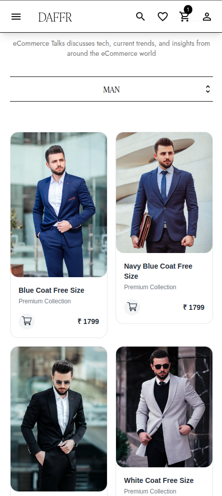
  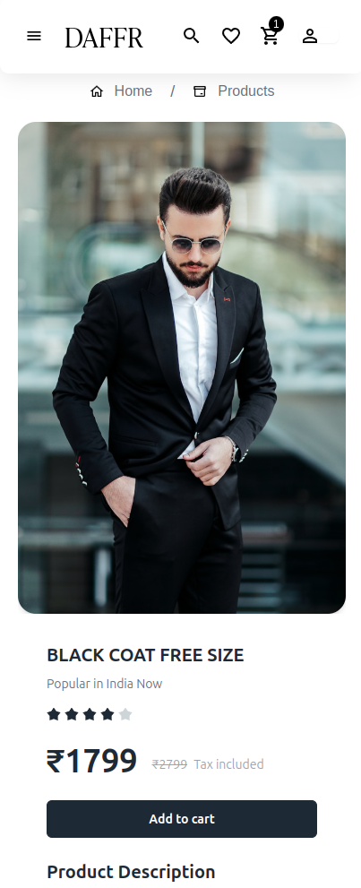
  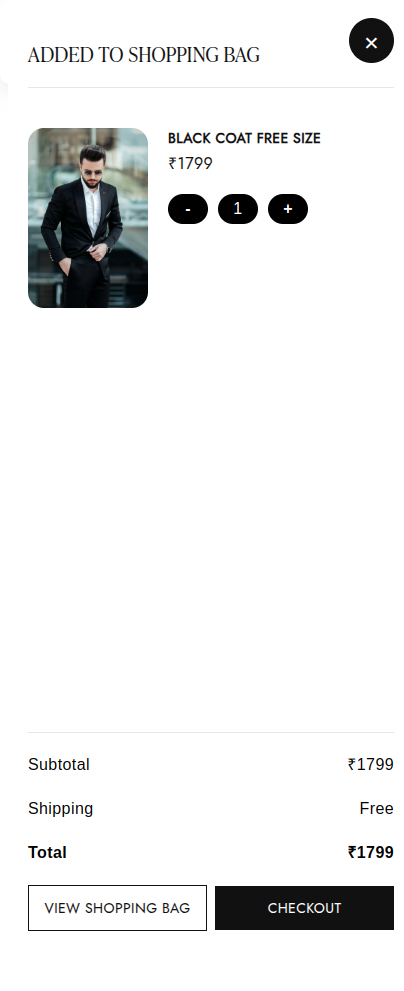
 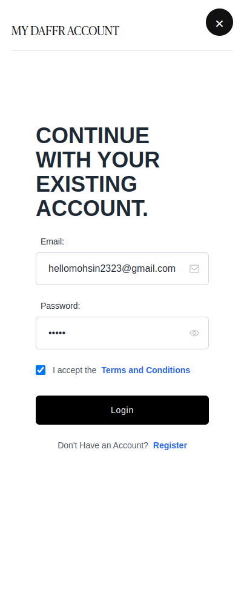
  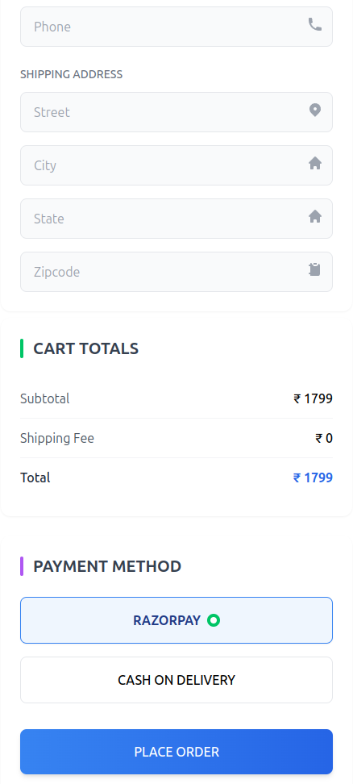
  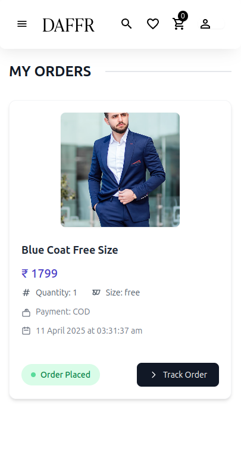
</p>

---

---
## Admin Panel
<p align="center">
  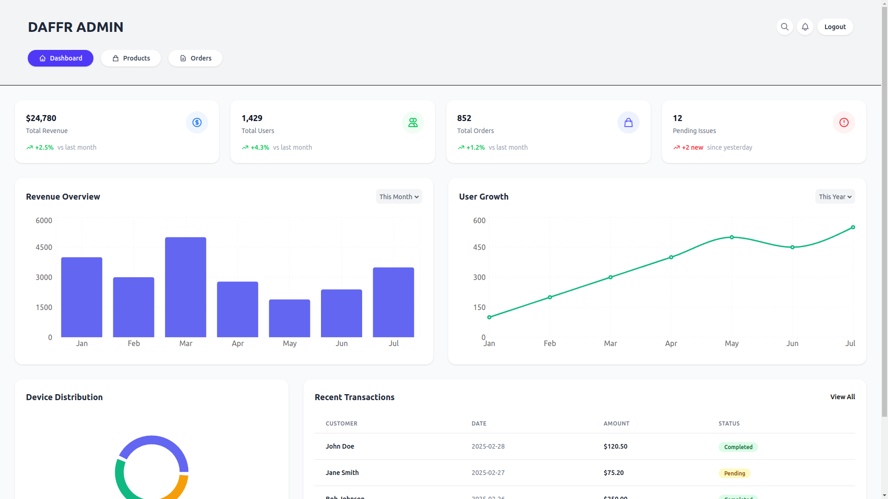
</p>

<p align="center">
  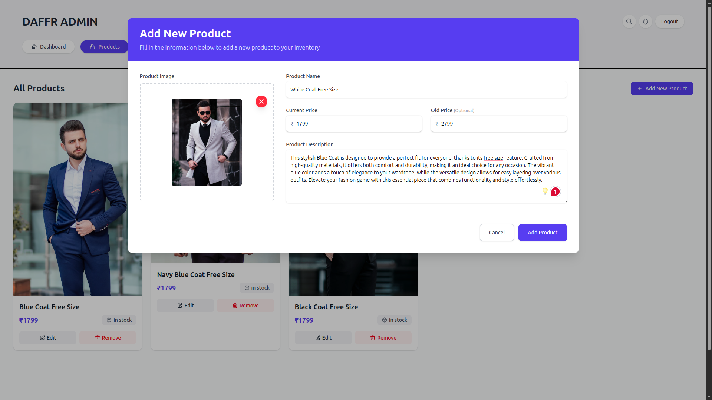
  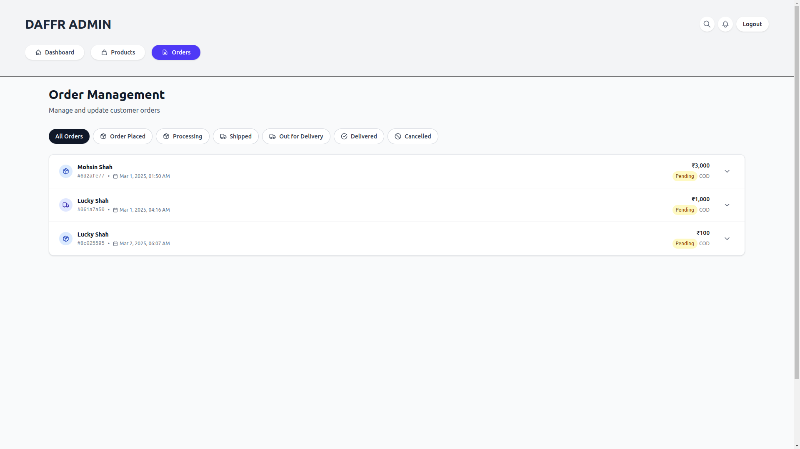
  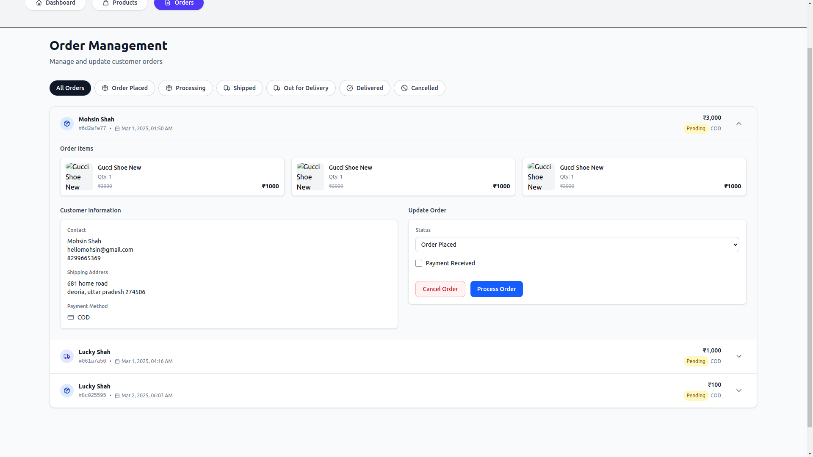

</p>

---


## 🚀 Features

- 🛒 Beautiful Storefront
- 🔍 Smart Product Search & Filters
- 📦 Cart & Checkout Flow
- 👤 User Authentication (JWT)
- 📈 Admin Dashboard
- 🧾 Order Tracking & History
- 📍 Local Delivery Ready

---

## 🛠️ Tech Stack

| Layer       | Tech Stack                         |
|-------------|-------------------------------------|
| Frontend    | React.js, Tailwind CSS, React Router |
| Backend     | Node.js, Express.js                |
| Database    | MongoDB (Mongoose ODM)             |
| Auth        | JSON Web Tokens (JWT)              |
| Admin Panel | React-based separate interface     |

---

## 📁 Project Structure

```
Daffr-Clothing/
├── client    # Customer Storefront (React)
├── admin/     # Admin Dashboard (React)
└── server/    # Express + MongoDB Backend
```

---

## ⚙️ Getting Started

### Prerequisites

- Node.js, npm
- MongoDB instance (local or cloud)

### Clone & Install

```bash
git clone https://github.com/shahmohsiin/Daffr-Clothing.git
cd Daffr-Clothing
```

---

### Backend Setup (`/server`)

```bash
cd server
npm install
```

Create a `.env` file:

```env
PORT=5000
MONGO_URI=your_mongodb_connection_string
JWT_SECRET=your_secret_key
```

Start server:

```bash
npm run dev
```

---

### Frontend Setup (`/client`)

```bash
cd ../client
npm install
npm start
```

Runs at: http://localhost:3000

---

### Admin Panel Setup (`/admin`)

```bash
cd ../admin
npm install
npm start
```

Runs at: http://localhost:3001

---

## 🔐 Admin Access

Either:
- Register a user and manually update their role in MongoDB Compass (`role: "admin"`)
- OR add a backend script to seed an admin user automatically

---

## 🚀 Deployment Recommendations

| Layer       | Service      |
|-------------|--------------|
| Frontend    | Vercel       |
| Admin Panel | Vercel       |
| Backend     | Render or Railway |

---

## 🤝 Contributing

Contributions, issues, and feature requests are welcome!  
Feel free to open a pull request.

---

## 📫 Contact

Made with ❤️ by [**Mohsin Shah**](https://github.com/shahmohsiin)

---

## 🪪 License

This project is licensed under the MIT License.
